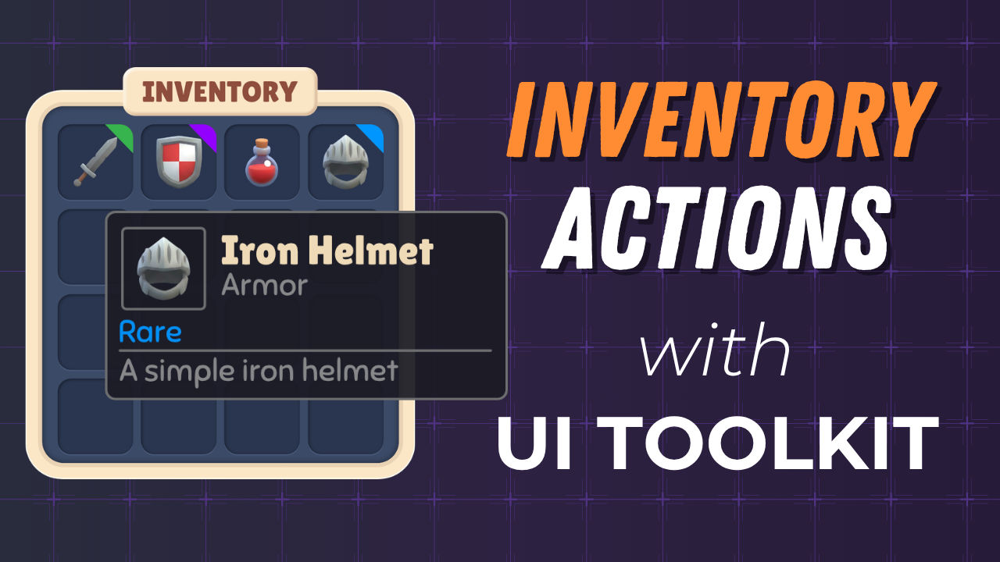

# Part 4: Inventory Interactions

In this tutorial you'll make the inventory interactive. You'll build a drag manipulator with a ghost preview that lets the player pick up items and swap or place them in any slot, wire up UI Toolkit's runtime data binding to drive a hover tooltip directly from `ItemData`, and add drop-target highlighting that toggles a USS class on the slot under the cursor so the player can see exactly where their item will land before they release.

## Course

This tutorial is part of the **[Build Inventory & Equipment Systems with Unity UI Toolkit](https://www.youtube.com/playlist?list=PLUQd-0PkiOI5_msWheOHo-XnyEvQPLpbR)** course. The full course walks you through building a complete inventory and equipment system in Unity 6 using UI Toolkit. You'll start from scratch with a reusable window system, design the full UI layout in UI Builder, wire up drag-and-drop item management, render a 3D character preview, and connect everything to player data. No prior UI Toolkit experience needed.

Check out the other parts:

| Part | Topic | Repository |
| ---- | ----- | ---------- |
| 1 | Reusable Window System | [ui-toolkit-pt1-reusable-window-system](https://github.com/gamedev-resources/ui-toolkit-pt1-reusable-window-system) |
| 2 | Design the Inventory UI | [ui-toolkit-pt2-inventory-design](https://github.com/gamedev-resources/ui-toolkit-pt2-inventory-design) |
| 3 | Create the Inventory Data Model | [ui-toolkit-pt3-inventory-data-model](https://github.com/gamedev-resources/ui-toolkit-pt3-inventory-data-model) |
| **4** | **Inventory Interactions** | *You are here* |
| 5 | Render a 3D Character Preview | [ui-toolkit-pt5-equip-char-preview](https://github.com/gamedev-resources/ui-toolkit-pt5-equip-char-preview) |
| 6 | Equip Items with Slot Validation | [ui-toolkit-pt6-equipment-interactions](https://github.com/gamedev-resources/ui-toolkit-pt6-equipment-interactions) |

## What's Included

- [`starter-project/`](starter-project/) - The starter project to follow along with the tutorial. Includes everything from Part 3 plus the new tooltip UXML/USS, ghost preview USS classes, and an `ItemDragManipulator` skeleton ready to be filled in.
- `final-project/`

## Starter Project

1. Clone or download this repository.
2. Open the `starter-project/` folder in **Unity 6** (via Unity Hub, "Open" -> select the `starter-project` directory).
3. Open the scene under `Assets/Scenes/` and press Play to verify the inventory window opens populated from Part 3.
4. Follow along with the video to add drag and drop, the runtime-bound tooltip, and drop-target highlighting.

## Resources

- [Full Playlist](https://www.youtube.com/playlist?list=PLUQd-0PkiOI5_msWheOHo-XnyEvQPLpbR)
- [Unity UI Toolkit Documentation](https://docs.unity3d.com/6000.0/Documentation/Manual/UIElements.html)
- [Runtime data binding](https://docs.unity3d.com/6000.0/Documentation/Manual/UIE-runtime-binding.html)

## Credits

- Item icons inspired by [KayKit Adventurers](https://kaylousberg.itch.io/kaykit-adventurers) by Kay Lousberg
